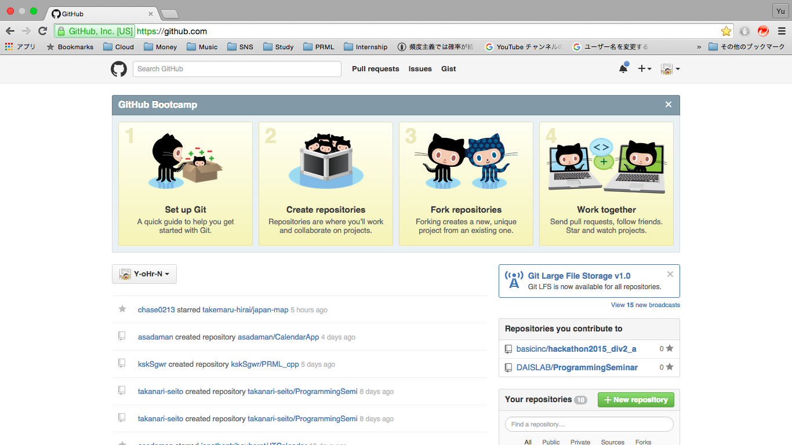
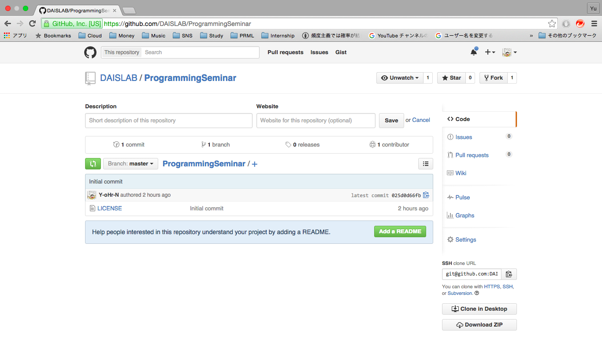

# Git/Github の簡単な使用方法

Author: Yu Ohori

Date: Oct/9/2015

Reference: [サルでもわかるGit入門](http://www.backlog.jp/git-guide/)

## 用語の説明
remote repository

local repository

index

working tree

add

commit

push

pull

branch

merge

fork

clone

origin

upstream

## ローカルのみで使用する場合
### 基本手順
空ディレクトリを生成

`$ mkdir <dirname>`

作成したディレクトリへ移動

`$ cd <dirname>`

ローカルリポジトリを作成

`$ git init`

空ファイルを生成

`$ touch <filename>`

テキストエディタなどでファイルを編集

ディレクトリまたはファイルをステージング

`$ git add <path>`

ディレクトリまたはファイルをコミット

`$ git commit -m "<massage>"`

### コミットに関する操作
コミットの履歴を表示

`$ git log`

直前のコミットを修正

`$ git commit --amend -m "<newmassage>"`

直前のコミットを取消

`$ git reset --soft/mixed/hard HEAD^`

* --soft: HEAD の位置に影響
* --mixed: HEAD の位置, インデックスに影響
* --hard: HEAD の位置, インデックス, ワーキングツリーに影響

n 個前のコミットを取消

`$ git reset --soft/mixed/hard HEAD~n`

### ブランチに関する操作
ブランチを作成

`$ git branch <branchname>`

ブランチを作成かつ切替

`$ git checkout -b <branchname>`

ブランチの一覧を表示

`$ git branch`

ブランチの名前を変更

`$ git branch -m <oldbranchname> <newbranchname>`

ブランチを切替

`$ git checkout <branchname>`

他のブランチをマージ

`$ git merge <branchname>`

## 個人のリモートリポジトリを使用する場合
### リモート側の操作
リモートリポジトリを作成

### ローカル側の操作
`$ git remote add origin git@github.com:<username>/<remotereponame>.git`

`$ git push -u origin <branchname>`

## 組織のリモートリポジトリを使用する場合
### リモート側の操作
目的のリモートリポジトリをフォーク

### ローカル側の操作
`$ git clone git@github.com:<username>/<remotereponame>.git`

`$ git remote add origin git@github.com:<username>/<remotereponame>.git`

`$ git remote add upstream git@github.com:<orgname>/<remotereponame>.git`

`$ git push -u origin <branchname>`

`$ git pull -u upstream <branchname>`
